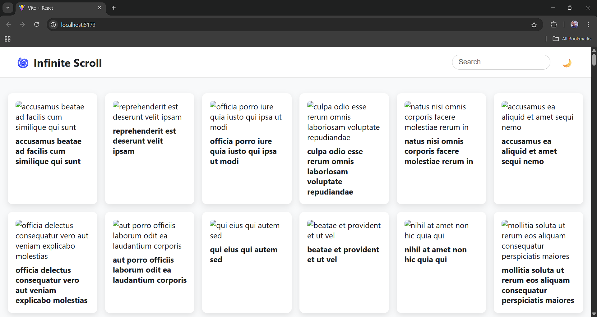
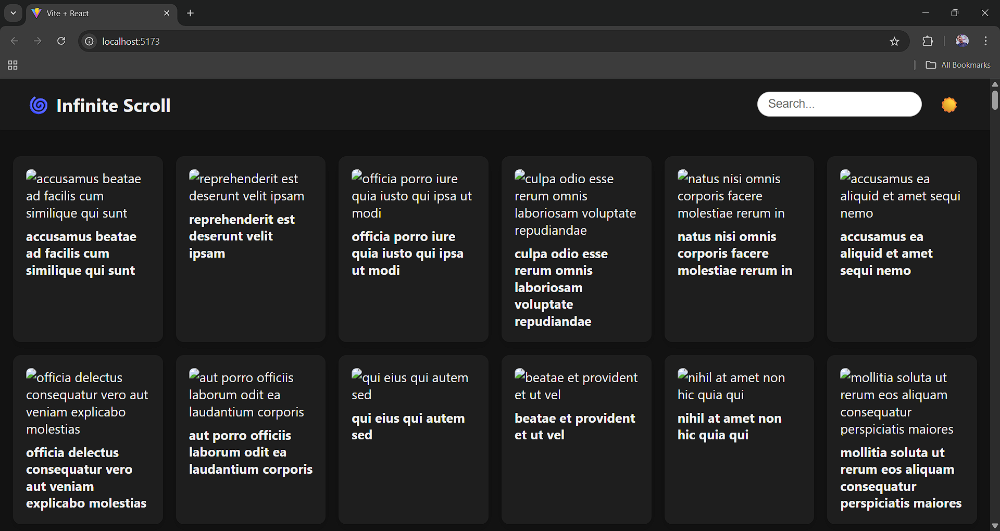

# 🌀 Infinite Scroll App

A responsive and visually appealing React.js application that demonstrates infinite scrolling using a public API (JSONPlaceholder).

## 🚀 Features

- 🔄 **Infinite Scroll**: Loads and appends new content as you scroll.
- 🔍 **Search Filtering**: Filter items by title in real-time.
- 📱 **Responsive Design**: Works smoothly on desktop, tablet, and mobile.
- 🌗 **Dark / Light Theme**: Toggle between light and dark modes.
- ⚠️ **Error Handling**: User-friendly messages if API fails.
- 🔧 **Reusable Components**: Clean structure and modular UI.
- 📭 **Empty State UI**: Shows friendly message if nothing matches the search.
- 🌐 **Public API**: Uses JSONPlaceholder's `/photos` endpoint.

---

## 🧰 Tech Stack

- React.js (with functional components and hooks)
- Vite
- Axios
- Plain CSS
- JSONPlaceholder API

---

## 📁 Project Structure

src/
├── components/ # Reusable UI components (ItemCard, Loader, ErrorMessage, Navbar)
├── context/ # Theme context for light/dark mode
├── pages/ # Home.jsx (main logic)
├── services/ # API abstraction
├── styles/ # App and component CSS
├── App.jsx # Main App
└── main.jsx # App entry point


## 🧪 Getting Started

### 📦 Clone and Setup

```bash
git clone https://github.com/namdevsahil/infinite-scroll-app.git
cd infinite-scroll-app
npm install
npm run dev


Requires Node.js and npm installed.

Submitted by: Sahil Namdev
GitHub Repo: https://github.com/namdevsahil/infinite-scroll-app
Assignment: DevifyX Infinite Scroll Setup


## 📸 Screenshots

### 🌞 Light Mode


### 🌙 Dark Mode

